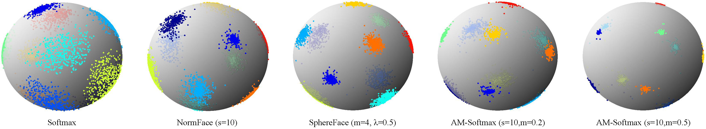

# Additive Margin Softmax for Face Verification 

by Feng Wang, Weiyang Liu, Haijun Liu, Jian Cheng

The paper is available as a technical report at [arXiv](https://arxiv.org/abs/1801.05599).

### Introduction

In this work, we design a new loss function which merges the merits of both [NormFace](https://github.com/happynear/NormFace) and [SphereFace](https://github.com/wy1iu/sphereface). It is much easier to understand and train, and outperforms the previous state-of-the-art loss function (SphereFace) by 2-5% on MegaFace. 

### Citation
If you find **AM-Softmax** useful in your research, please consider to cite:

	@article{Wang_2018_amsoftmax,
	  title = {Additive Margin Softmax for Face Verification},
	  author = {Feng Wang, Weiyang Liu, Haijun Liu, Jian Cheng},
	  journal = {arXiv preprint arXiv:1801.05599},
	  year = {2018}
	}

### Training

**Requirements:** My Caffe version https://github.com/happynear/caffe-windows. This version can also be compiled in Linux.

The prototxt file is in `./prototxt`. The batch size is set to 256. If your GPU's memory is not sufficient enough, you may set `iter_size: 2` in `face_solver.prototxt` and `batch_size: 128` in `face_train_test.prototxt`.

The dataset used for training is CASIA-Webface. We removed 59 identities that are duplicated with LFW (17) and MegaFace Set 1 (42). This is why the final inner-product layer's output is `10516`. The list of the duplicated identities can be found in https://github.com/happynear/FaceDatasets.

All other settings are the same with SphereFace. Please refer to the details in [SphereFace's repository](https://github.com/wy1iu/sphereface).

### Model and Training Log

Feature normalized, s=30, m=0.35: [OneDrive](https://stduestceducn-my.sharepoint.com/:u:/g/personal/201411020102_std_uestc_edu_cn/ER-9FNdXCXtPlZAwZQwFmW0BdMVUjG8_y9IodYfoHVYXSg?e=QBG13o), [Baidu Yun](https://pan.baidu.com/s/1hulG7QW) .

### Results
See our [arXiv technical report](https://arxiv.org/abs/1801.05599).
